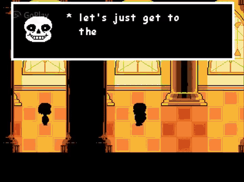

# GIF FACTORY
Утилита для быстрой работы с файлами формата `.gif`

**Пример работы:** Angry birds movie ужат до 8 мегабайт и ускорен в 40 раз

<p align="center">
  
</p>

___

# Зависимости

1. Установленный **Python 3.8+**
2. Установленный **FFmpeg** (должен быть прописан в `PATH`).
3. (Опционально) **tqdm** для отрисовки красивых прогресс-баров в консоли:

   ```bash
   pip install tqdm
    ```

___

# Использование

```bash
    python GIFEST.py [args] [path]
```
Реккомендуется указывать путь до файла в самом конце, так как утилита может зависать

## Аргументы
### Основные
- `-h`, `--help` - выводит справку по аргументам
- `path` - путь к конкретному файлу или папке. По умолчанию берётся папка, где лежит `GIFEST.py`
- `-s`, `-compress` - Целевой размер файла в мегабайтах. Скрипт будет сжимать файл, пока не уложится в ограничения
- `-u`, `-ultra` - флаг для включения хардкорных пресетов сжатия. Используется для больших и тяжёлых видео
- `-speed` - множитель скорости видео (2.0 - быстрее в 2 раза, 0.5 - медленнее в 2 раза)
- `-o`, `--output` - имя папки, куда сохранять готовые гифки
- `-m`, `-mode` - выбор режима работы (по умолчанию *smooth*). **Доступные режимы:** *default*, *smooth*, *emote*
    - Режим *smooth* уменьшает палитру, оставляя видеоряд гифки плавным
    - Режим *emote* уменьшает размер гифки практически без потери качества. Просто забавный режим, чтобы сжать гифку
    - Режим *default* уменьшает палитру, но главное - ФПС

### Текст и демотиваторы
- `-ut`, `--upper-text` - текст сверху гифки (большой текст в демотиваторах)
- `-bt`, `--bottom-text` - текст снизу гифки (маленький текст в демотиваторах)
- `--text-layout` - стиль текста (по умолчанию *pad*)
    - Режим *pad* расширяет гифку
    - Режим *overlay* пишет текст поверх гифки
    - Режим *demotivator* добавляет чёрную рамку
- `--bg-color` - цвет заднего фона (для *pad*)
- `--text-color` - цвет текста
- `--font` - шрифт текста. Указывается в виде системного имени шрифта или полный путь к `.ttf` файлу

### Дополнительные
- `-rv`, `-reverse` - конвертировать видео задом наперёд
- `-nuke` - наложить на гифку эффект Deepfry (выжженые цвета, перешакал)
- `-gpu` - Включает *NVENC* (только видеокарты NVIDIA) для пре-пасса тяжёлых видео
- `-j`, `--jobs` - количество потоков

## Примеры
- `python GIFEST.py` - сконвертировать все видео в папке в гифки
- `python GIFEST.py -compress 10 "Examples/Rumia dancing to her theme.mp4"` - превратить видео в [гифку]() и сжать её до 10 мб (10 мегабайт - ограничение Дискорда на размер гифок)
- `python GIFEST.py -speed 40 -compress 10 -ultra "Angry_birds_movie.mkv` - ускорить [Angry birds movie](#gif-factory) до 10 мб и ускорить его в 40 раз
- `python GIFEST.py -speed 20 -compress 10 "Family_guy.mp4"` - засунуть серию [Гриффинов](#family-guy) в 10 мб

- `python GIFEST.py -compress 0.25 -m emote "cat_disco.mp4"` - получить мини гифку
    <p align="center">
        
    </p>
- `python GIFEST.py -ss "00:00:07" -to 187 -speed 4 "sonic_wave.mp4"` - обрезать [Sonic wave](#sonic-wave-4x). Начать с 7 секунды, закончить на 3 минуты 7 секунд

___

# Гифки из [примеров](#примеры)

## [Sonic wave 4x](https://youtu.be/Dfm_LegCN9Q?si=Lfc9kxVBoY1U8vU7)

<p align="center">
  
</p>

## [Family guy](https://www.youtube.com/watch?v=mn-Tlb_wfjc)

<p align="center">
    
</p>

# Другие примеры

## -m emote
### Thanos
<p align="left">
    
    
    
    
    
    
    
    
    
    
    
    
</p>

### [Small Rumias dancing to her themes](https://www.youtube.com/watch?v=eK3L7E4k-VA)
`python GIFEST.py -compress 2 -m emote "Rumia dancing to her theme.mp4"`

<p>
    
    
    
    
    
    
    
    
    
    
    
    
</p>

## [Undertale Sans bossfight](https://youtu.be/Vr4IYjeplJA?si=Sqn6e7KNvY-_2dPH)
<p align="center">
    
</p>

## [Rumia dancing to her theme](https://www.youtube.com/watch?v=eK3L7E4k-VA)

<p align="center">
    
</p>